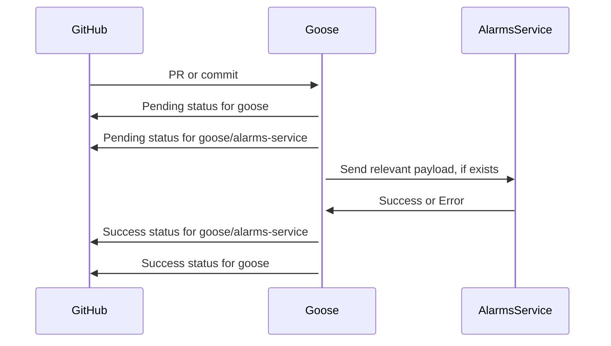
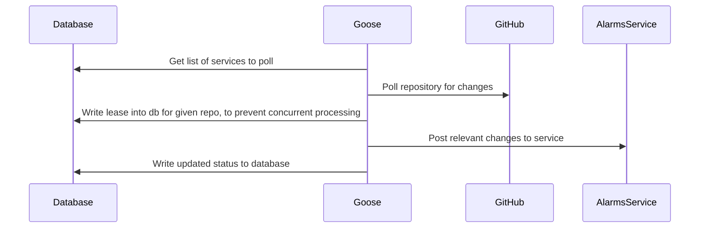

Ideally, this app will focus as a simple call & response style API. At a high
level, it looks like this.

If there is an error, however, we need to be able to recover. We'd love to solve this without having to maintain a database, because databases add a bunch of infrastructure that's more difficult to maintain.

Errors may be:
1. Timeouts
2. Unable to get or parse GitHub's initial payload
3. Unexpected crash mid-process

For the timeout or crash case, the simplest solution is to allow users a
mechanism to retry. This means the first thing that should happen when we're
told about an event is to mark it as in-progress for the goose process using
the GitHub statuses API.

In order to retry, we can monitor comments to the pull request. If a user says
`retry $service`, then we can retry that particular service.

The failure to get the initial payload is a harder problem, however. This is also the same use-case as github instances that are behind a NAT or similar. To solve this, we need to support a polling mechanism. This requires a database.

Because the database happens after the change to the alarms service, this means we could send duplicate messages in the case of errors. Luckily, we'll always send the most up-to-date version of the repository. This means that **backing services MUST be idempotent**. This work is tracked in [this ticket](https://github.com/eBay/goose/issues/10).
