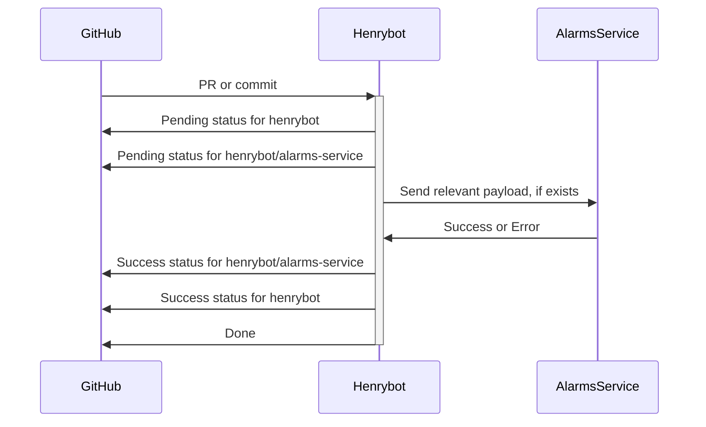

Ideally, this app will focus as a simple call & response style API. At a high
level, it looks like this.

If there is an error, however, we need to be able to recover. Ideally, we'd do
this without having to maintain a database, because databases add a bunch of
infrastructure that's more difficult to maintain.

Errors may be:
1. Timeouts
2. Unable to get or parse GitHub's initial payload
3. Unexpected crash mid-process

For the timeout or crash case, the simplest solution is to allow users a
mechanism to retry. This means the first thing that should happen when we're
told about an event is to mark it as in-progress for the henrybot process using
the GitHub statuses API.

In order to retry, we can monitor comments to the pull request. If a user says
"retry <service>", then we can retry that particular service.

The failure to get the initial payload is a harder problem, however. One partial
solution is to monitor unhandled exceptions and manually (for now) redrive those
messages (eew). The solution to this problem is tracked in #29.
